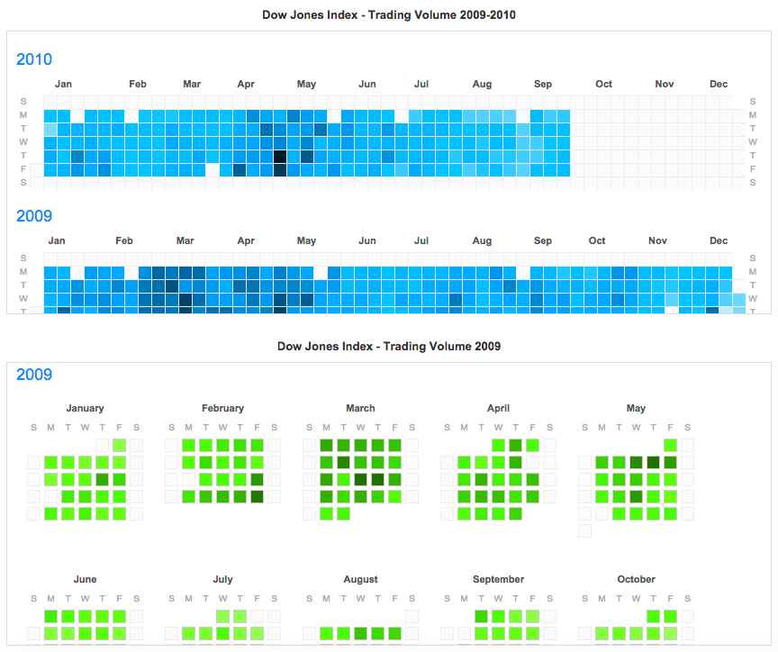

# Activity heatmap calendar

Implements an activity heatmap, which shows activity levels on a
calendar. An example is shown below:

## Usage

Example usage in `index.html`. The code segment that initialises the
activity heatmap is as follows:

            d3.csv("dji.csv", function(data) {
                var activityMap = new ActivityMap(data, {
                    "id": "dji-volume-map",
                    "parent": "#activitymap-container",
                    "title": "Dow Jones Index - Trading Volume ",
                    "timeColumn": "Timestamp",
                    "valueColumn": "Volume"
            });
            activityMap.render();

The API call takes the form:

            var activityMap = new ActivityMap(data, config);

Where `config` can have the following attributes:

* `id`: DOM identifier to use for the activity map.
* `parent`: The container DOM node. You can either specify a D3 node,
  or a CSS selector.
* `title`: Title to use at the top of the activity heatmap. The year
  range that is visible will be displayed as a suffix.
* `timeColumn`: In the input CSV data file, which column should we use
  to get the activity timestamp. **The time in `data` is specified either as an
  integer that represents the Unix timestamp in milliseconds, or as a
  JavaScript [Date()](https://developer.mozilla.org/en/docs/Web/JavaScript/Reference/Global_Objects/Date) object.**
* `valueColumn`: In the input CSV data file, which column should we
  use to get the value to be used as heatmap value.
* `colours`: Array of colours that should be used to represent
  activity intensity. This is calculated according to the heatmap
  value relative to the maximum heatmap value in the data set. These
  colours should be specified as a gradient starting with the colour
  for the lowest value, and ending with the colour for the highest value.
* `fit`: Optional parameter that allows the resizing of the activity
  map. By default, the activity map will exists inside the supplied
  container. To make the container fit the activity map, set `fit` to
  `true`. See `index.html` for example.
* `hue`: Optional parameter that sets the Hue for the cell colour
  gradient. The value should be in the closed interval `[0, 360]`. By
  default, Hue is set to `85`.

If the config is unspecified, the following values will be taken by
default:

* `id`: 'example-activity-map'
* `parent`: 'body'
* `hue`: 85
* `title`: 'Activity map: '
* `timeColumn`: 't'
* `valueColumn`: 'v'
* `fit`: false

## Note

The Dow Jones Index, trading volume data was taken from this 
[d3js example](http://bl.ocks.org/mbostock/4063318).
